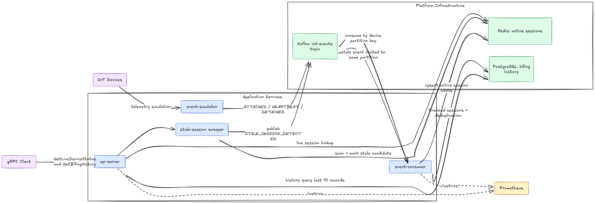
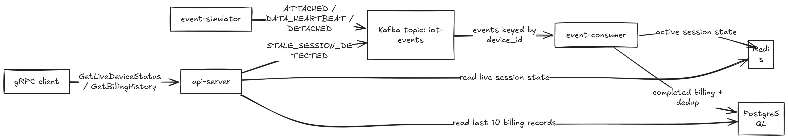
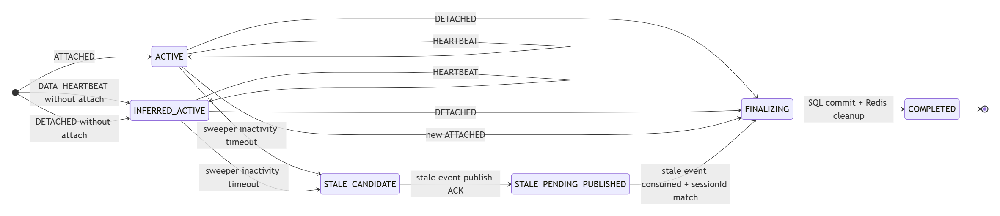
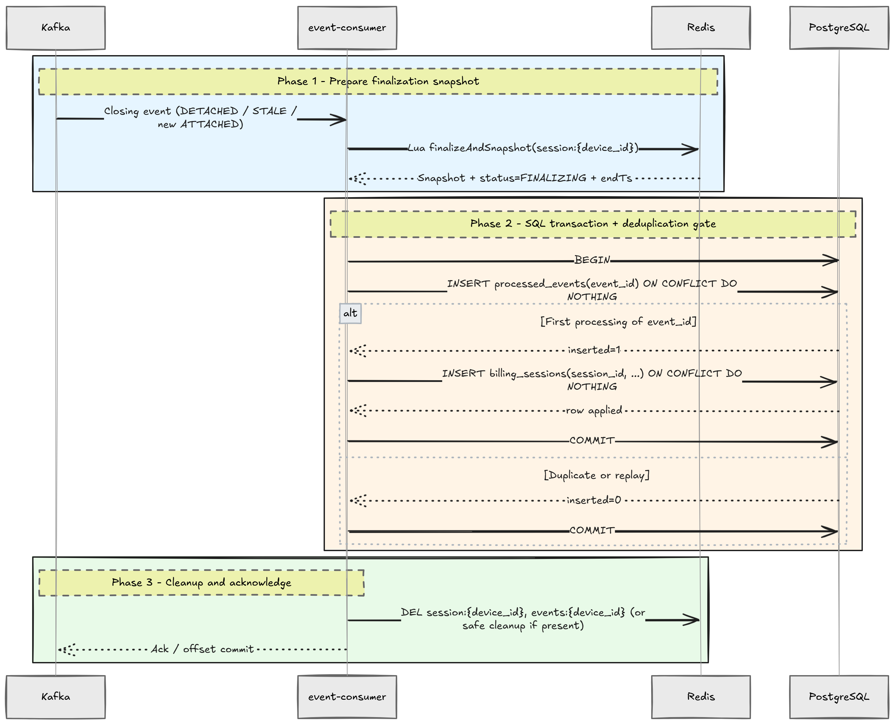
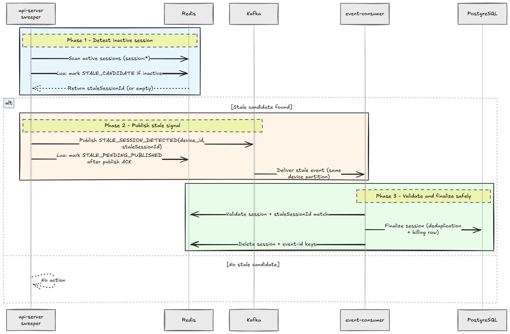

# Distributed Data Platform Design

## 1. Purpose and Scope

This document describes the design and implementation of a distributed telemetry processing platform for billing workflows. The platform is designed for correctness under at-least-once delivery, duplicate events, out-of-order arrival, and partial failure.

Primary objectives:
- Correct session aggregation and billing finalization
- Idempotent and replay-safe processing
- Safe behavior under horizontal scaling
- Clear operational visibility and deployability

## 2. Design Principles

- Use Redis for low-latency mutable session state.
- Use PostgreSQL as the source of truth for completed billing sessions.
- Preserve per-device ordering by publishing Kafka messages with `device_id` as the key.
- Ensure completion logic is crash-safe and idempotent.

## 3. System Architecture

Platform components:
- `event-simulator`: event ingestion service (producer)
- `event-consumer`: processing engine (consumer)
- `api-server`: gRPC API and stale-session sweeper
- `common-lib`: shared event contract

Infrastructure components:
- Kafka: event transport, with per-device partitioned ordering (`device_id` key)
- Redis: hot session state
- PostgreSQL: durable billing state and deduplication records

Service/module READMEs:
- [event-simulator/README.md](event-simulator/README.md)
- [event-consumer/README.md](event-consumer/README.md)
- [api-server/README.md](api-server/README.md)
- [common-lib/README.md](common-lib/README.md)

### 3.1 Service Interaction Diagram



### 3.2 Data Flow Diagram



### 3.3 Session State Transition Diagram



Edge-case behavior represented in implementation:
- Duplicate heartbeat (`event_id` already processed): ignored for byte aggregation.
- Out-of-order heartbeat (older timestamp): does not move `lastActive` backward.
- `DATA_HEARTBEAT` without prior `ATTACHED`: creates an inferred active session (`INFERRED_ACTIVE`).
- `DETACHED` without prior `ATTACHED`: creates inferred session, then finalizes as `DETACHED_WITHOUT_ATTACH`.
- New `ATTACHED` while a session is active: existing session is finalized first (`FINALIZED_INCOMPLETE`), then a new session starts.
- Stale event with non-matching `staleSessionId`: ignored to prevent finalizing the wrong session.
- Stale event when session is not stale-ready: ignored to avoid premature closure.
- Heartbeat received while session is in stale-tracking states: session is reactivated to `ACTIVE`.
- Malformed events (missing required fields or invalid values): rejected and counted in malformed-event metrics.

## 4. Event Model and Delivery Characteristics

Shared event schema (`common-lib`):
- `event_id`
- `device_id`
- `type`
- `timestamp`
- `bytes_transferred` (heartbeat events)
- `schema_version`
- `staleSessionId` (stale finalization targeting)

Delivery assumptions:
- At-least-once delivery semantics
- Duplicate delivery is expected
- Delivery order may differ from event timestamp order
- Per-device ordering is achieved via Kafka key partitioning on `device_id`

### 4.1 At-Least-Once Delivery Implementation

At-least-once behavior is achieved through the following design choices:

- Producer durability settings:
  - Kafka producer uses `acks=all`.
  - Producer retries are enabled.
  - These settings prioritize successful broker persistence over drop-on-failure behavior.

- Consumer offset strategy:
  - Auto-commit is disabled (`enable-auto-commit=false`).
  - Listener acknowledgment mode is batch-based (`ack-mode=batch`).
  - Offsets are committed only after listener processing completes successfully for the batch.

- Failure and retry behavior:
  - When processing throws an exception, the listener does not acknowledge success for that batch.
  - Offsets are therefore not advanced for failed records, and records are retried/redelivered.
  - If a consumer instance goes down, processing resumes from the last committed offset; uncommitted records are re-read (expected under at-least-once semantics).

- Replay safety:
  - Duplicate processing is expected under at-least-once semantics.
  - Idempotency controls (Redis event-id tracking + PostgreSQL deduplication table) ensure retries do not cause double billing.

## 5. Service Responsibilities

### 5.1 Event Ingestion Service (`event-simulator`)

Responsibilities:
- Simulate 10,000+ devices
- Emit `ATTACHED`, `DATA_HEARTBEAT`, and `DETACHED` events
- Inject ~5% out-of-order events
- Inject ~2% duplicate events

Producer reliability/performance configuration:
- `acks=all`
- retries enabled
- batching enabled (`batch-size`, `linger-ms`)

### 5.2 Processing Engine (`event-consumer`)

Responsibilities:
- Maintain active session state in Redis
- Apply session lifecycle transitions
- Persist completed sessions in PostgreSQL
- Enforce idempotency and replay safety

Core behavior:
- `ATTACHED`: starts a session; finalizes existing active session first (`FINALIZED_INCOMPLETE`) if present.
- `DATA_HEARTBEAT`: updates usage and activity; creates `INFERRED_ACTIVE` if attach was not observed.
- `DETACHED`: finalizes active session; supports detach-without-attach via inferred session (`DETACHED_WITHOUT_ATTACH`).
- `STALE_SESSION_DETECTED`: finalizes only when stale event targets current session and stale status is valid.

### 5.3 API Layer (`api-server`, gRPC)

Methods:
- `GetLiveDeviceStatus`
- `GetBillingHistory` (last 10 records)

Validation and authentication:
- Bearer token authentication in gRPC metadata
- `device_id` required, max length 50, pattern restricted
- Authentication failure: `UNAUTHENTICATED`
- Validation failure: `INVALID_ARGUMENT`

Example calls:

```bash
grpcurl -plaintext \
  -H "authorization: Bearer skylo-dev-token" \
  -d '{"device_id":"device-123"}' \
  localhost:9091 skylo.billing.v1.BillingApi/GetLiveDeviceStatus
```

```bash
grpcurl -plaintext \
  -H "authorization: Bearer skylo-dev-token" \
  -d '{"device_id":"device-123"}' \
  localhost:9091 skylo.billing.v1.BillingApi/GetBillingHistory
```

### 5.4 Stale Session Sweeper (`api-server`)

Responsibilities:
- Periodically scan active sessions in Redis
- Mark stale candidates atomically (Lua)
- Publish `STALE_SESSION_DETECTED` back to Kafka with device key
- Mark `STALE_PENDING_PUBLISHED` only after publish acknowledgment
- Do **not** finalize stale sessions inside `api-server`; finalization is delegated to `event-consumer`

Rationale:
- Avoids full-key scans in every consumer instance
- Preserves per-device ownership by routing stale finalization through Kafka
- Avoids dependency on keyspace notifications for correctness
- Prevents race conditions by ensuring only the Kafka owner (`event-consumer` for that device partition) performs session finalization

## 6. Data Modeling

### 6.1 Redis Model (Hot State)

Redis keys and structures:

1) Session hash key
- Key pattern: `session:{device_id}`
- Data type: Redis Hash
- Purpose: mutable in-progress session state for a single device

Session hash fields:
- `sessionId` (string/UUID): active session identifier
- `deviceId` (string): device identifier (partition key identity)
- `startTs` (RFC3339 timestamp string): session start time
- `lastActive` (RFC3339 timestamp string): most recent accepted activity timestamp
- `totalBytes` (long as string): accumulated transferred bytes
- `status` (string enum-like): e.g., `ACTIVE`, `INFERRED_ACTIVE`, `FINALIZING`, `STALE_CANDIDATE`, `STALE_PENDING_PUBLISHED`
- `endTs` (optional RFC3339 timestamp string): finalization timestamp when session transitions toward completion
- `staleCandidateAt` (optional RFC3339 timestamp string): when sweeper marked candidate stale
- `stalePublishedAt` (optional RFC3339 timestamp string): when stale event publication was acknowledged

2) Event-id dedup set key
- Key pattern: `events:{device_id}`
- Data type: Redis Set
- Purpose: deduplication gate for event IDs seen in the active session window
- Members: `eventId` strings

Operational notes:
- Redis is used as hot mutable state, not final source of truth.
- Atomic Lua scripts are used for save/finalize/delete transitions to avoid partial updates.
- TTL policy: active session keys are not finalized via TTL expiry; stale handling is intentionally driven by the sweeper + explicit stale events to avoid missed billing due to lost expiration notifications.

### 6.2 PostgreSQL Model (Completed State)

`processed_events` (deduplication guard table):
- Purpose: ensures replayed closing events do not apply completion side effects twice
- Columns:
  - `event_id` UUID PRIMARY KEY
  - `device_id` VARCHAR(50) NOT NULL
  - `event_type` VARCHAR(40) NOT NULL
  - `event_ts` TIMESTAMPTZ NOT NULL
  - `seen_at` TIMESTAMPTZ NOT NULL DEFAULT `now()`

`billing_sessions` (finalized billing records table):
- Purpose: durable completed-session ledger used by API history queries
- Columns:
  - `session_id` UUID PRIMARY KEY
  - `device_id` VARCHAR(50) NOT NULL
  - `start_ts` TIMESTAMPTZ NOT NULL
  - `end_ts` TIMESTAMPTZ NOT NULL
  - `total_bytes` BIGINT NOT NULL DEFAULT `0`
  - `final_status` VARCHAR(40) NOT NULL
  - `finalized_at` TIMESTAMPTZ NOT NULL DEFAULT `now()`
  - `finalized_by_event_id` UUID NOT NULL

Constraints and indexes:
- Foreign key: `billing_sessions.finalized_by_event_id` -> `processed_events.event_id`
- Read-path index: `(device_id, finalized_at DESC)` for `GetBillingHistory`

Source of truth for completed sessions:
- `billing_sessions` in PostgreSQL

## 7. Correctness and Data Integrity

### 7.1 Idempotency Strategy

Layered duplicate-event protection:
1. Redis set `events:{device_id}` prevents duplicate heartbeat byte aggregation for active sessions.
2. PostgreSQL `processed_events(event_id)` prevents duplicate completion effects.

### 7.2 Ordering Strategy

- Event producers publish with `device_id` key.
- Kafka partition order serializes per-device processing.
- Out-of-order timestamps are tolerated; state uses monotonic `lastActive` updates.

### 7.3 Concurrency Strategy

- Per-device partitioning prevents concurrent writers for the same device in normal operation.
- Redis Lua scripts guarantee atomic session updates.
- SQL constraints ensure replay-safe completion.
- Stale handling is routed back through Kafka to maintain ownership discipline.

### 7.4 Edge-Case Handling Strategy

- Duplicate heartbeat (`event_id` already processed): ignored for byte aggregation.
- Out-of-order heartbeat (older timestamp): does not move `lastActive` backward.
- `DATA_HEARTBEAT` without prior `ATTACHED`: creates an inferred active session (`INFERRED_ACTIVE`).
- `DETACHED` without prior `ATTACHED`: creates inferred session, then finalizes as `DETACHED_WITHOUT_ATTACH`.
- New `ATTACHED` while a session is active: existing session is finalized first (`FINALIZED_INCOMPLETE`), then a new session starts.
- Stale event with non-matching `staleSessionId`: ignored to prevent finalizing an unrelated active session.
- Stale event when session is not in a stale-ready status: ignored to avoid premature closure.
- Heartbeat received while session is in stale-tracking states: session is reactivated to `ACTIVE`.
- Malformed events (missing required fields or invalid values): rejected and counted in malformed-event metrics.

### 7.5 Atomicity Strategy

Atomicity is achieved in layered steps (without a cross-store distributed transaction):

1. Redis atomic state transition (Lua)
- Session updates (`save`, `finalizeAndSnapshot`, `delete`) are executed through Lua scripts.
- Each Lua script runs atomically in Redis, so partial field updates cannot occur.

2. SQL atomic completion (single DB transaction)
- Finalization writes run inside one PostgreSQL transaction.
- `processed_events` dedup insert and `billing_sessions` upsert commit or roll back together.

3. Ordered cross-store sequence for safety
- Flow is: Redis `FINALIZING` snapshot -> SQL commit -> Redis cleanup.
- If SQL commit fails, Redis session remains recoverable and can be retried.
- If crash happens after SQL commit but before Redis delete, replay is absorbed by deduplication and cleanup remains safe.

## 8. Reliability and Failure Handling

Completion sequence:
1. Redis Lua script marks `FINALIZING`, sets `endTs`, returns a consistent snapshot.
2. SQL transaction performs:
  - deduplication insert into `processed_events`
  - conflict-safe insert into `billing_sessions`
3. Redis keys are deleted only after successful database commit.



Failure handling:
- Crash before SQL commit: session remains recoverable in Redis and event can be retried.
- Crash after SQL commit but before Redis delete: replay is handled by SQL deduplication; cleanup remains safe.

Crash scenarios during finalization (Redis -> SQL):

- Redis unavailable during snapshot/finalize step:
  - `finalizeAndGetSnapshot` cannot complete, so the finalization flow does not proceed to SQL.
  - No billing row is written in this attempt.
  - Once Redis is back, stale/close events can re-trigger finalization.

- SQL unavailable or SQL transaction failure:
  - Redis session snapshot remains the recovery anchor (session finalization has not been committed to PostgreSQL yet).
  - Since SQL commit did not succeed, `billing_sessions` is not finalized for that attempt.
  - Finalization can be re-attempted, and idempotency guards prevent duplicate durable completion.

- Consumer process down/crash during finalization:
  - If crash happens before SQL commit, durable completion did not occur yet; session is still recoverable.
  - If crash happens after SQL commit but before Redis cleanup, replay is absorbed by `processed_events` deduplication and cleanup remains safe.
  - When consumer resumes, Kafka partition ownership model continues to enforce single-writer processing per device.
  - Partition reassignment resumes consumption from the last committed offset, so uncommitted records are replayed safely.

## 9. Stale Session Handling

Configured policy:
- expected heartbeat cadence (assumption): ~30 seconds
- stale threshold default: 90 seconds (`SWEEPER_STALE_THRESHOLD_SECONDS`)
- scan interval default: 60 seconds (`SWEEPER_SCAN_INTERVAL_MS`)

Operational rationale:
- Sweeper + explicit event publication is preferred to keyspace notifications for reliability and replayability.

Why not Redis TTL + keyspace notifications for stale closure:
- Keyspace notifications are best-effort event signals, not a durable workflow queue.
- If the consumer/service handling expiration notifications is down or disconnected, notification events can be missed.
- With missed notifications, expired session keys may be deleted without finalization, which risks missing billing records.

Why cron-based sweeper is used instead:
- The system assumes heartbeat cadence of ~30 seconds and treats sessions as stale after 90 seconds of inactivity.
- A scheduled sweeper job runs every 60 seconds, scans active sessions, marks stale candidates atomically, and publishes explicit stale events.
- `api-server` publishes a new `STALE_SESSION_DETECTED` event but does not finalize directly; this keeps a single writer model per device and avoids stale-vs-live race conditions.
- Finalization then flows through `event-consumer` with idempotent DB writes, so stale closure remains replay-safe.

Trade-off:
- Cost: periodic key scanning adds background Redis read overhead.
- Benefit: deterministic stale-session recovery; sessions are not silently lost due to missed ephemeral notification delivery.

Crash scenarios during stale detection and stale-event publishing:

- `api-server` crashes before marking stale candidate:
  - No stale candidate state is written for that pass.
  - Next scheduled sweep re-scans the same active sessions and retries detection.

- `api-server` crashes after marking `STALE_CANDIDATE` but before Kafka publish:
  - Session remains in stale-candidate tracking state in Redis.
  - A later sweep run can retry publish for that candidate.

- Kafka publish attempt fails or times out:
  - `STALE_PENDING_PUBLISHED` is not marked as successful publication.
  - Candidate remains recoverable for retry in subsequent sweeps.

- `api-server` crashes after Kafka publish but before marking publish state:
  - Duplicate stale-event publication may occur on retry.
  - Safety is preserved because `event-consumer` validates `staleSessionId` and finalization is idempotent.

- `event-consumer` is down when stale event is published:
  - Stale event remains in Kafka until the consumer group resumes/rebalances.
  - Processing resumes from committed offsets; stale finalization executes when the owning consumer is back.



## 10. Observability and Operability

Metrics endpoint:
- Prometheus format at `/metrics`

Monitoring runtime:
- Prometheus UI: `http://localhost:9090`
- Grafana UI: `http://localhost:3000`
- Provisioned dashboard: `IoT Billing Overview`

Implemented metrics:
- `events_malformed_total`
- `events_duplicate_total`
- `events_out_of_order_total`
- `processing_latency_seconds` (histogram with percentile support, including p99)

Logging:
- Structured contextual logs for event processing, stale sweeper operations, and gRPC request/auth outcomes

## 11. Deployment and Runtime Configuration

Deployment characteristics:
- All services containerized
- Single-command startup: `docker compose up -d --build`
- Environment-variable driven runtime configuration
- Health-gated startup order for ZooKeeper, Kafka, Redis, PostgreSQL, and application services

## 12. Concurrency and Scaling Strategy (Toward 1M Concurrent Devices)

Priority sequence:
1. Increase Kafka partition count and consumer replica count.
2. Scale Redis (cluster/sharding) and monitor active-session plus deduplication-key memory footprint.
3. Improve SQL write throughput via partitioning and index tuning.
4. Tune producer/consumer batching, polling, and compression.
5. Add autoscaling and alerting based on lag, latency, stale-publish failures, and duplicate-rate spikes.

## 13. Assumptions and Trade-offs

Assumptions:
- `device_id` keying is consistent and mandatory
- event timestamp is authoritative for business logic
- PostgreSQL is the source of truth for completed sessions

Trade-offs:
- Additional complexity from Redis + SQL dual-state in exchange for performance and durability
- Periodic sweeper overhead in exchange for deterministic stale-session handling
- Prioritize correctness and billing safety first, then optimize performance incrementally through measured tuning

## 14. AI Tool Transparency

Used ChatGPT and Copilot for reviewing the design architecture, boilerplate code generation and writing documentation.

Final decision ownership:
- Architecture, state-transition behavior, idempotency strategy, stale-session handling approach, and scaling priorities were reviewed and finalized by me.
