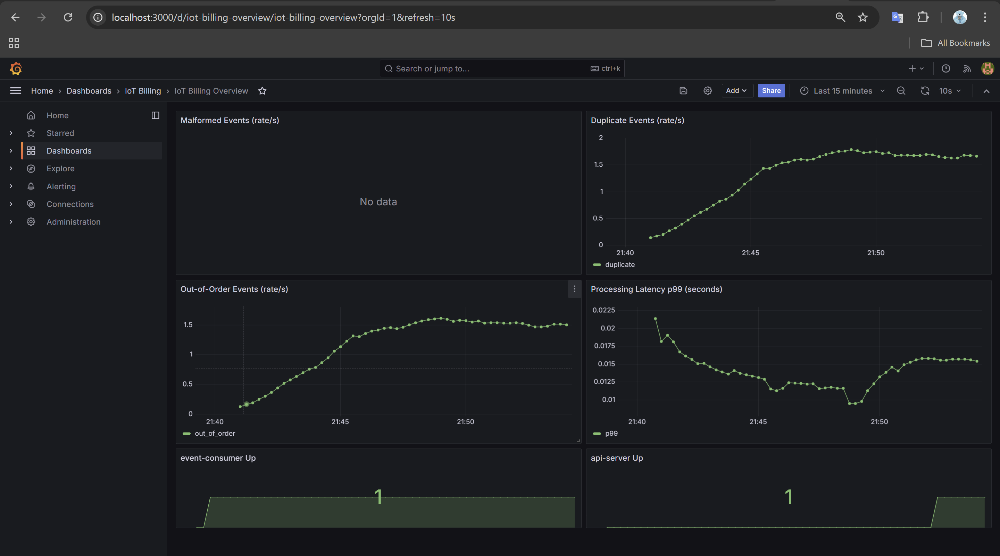

# IoT Billing Platform

## Requirements

### For Docker-based run

- Docker Desktop (or Docker Engine + Docker Compose v2)
- At least 8 GB RAM available for containers (Kafka + DB + services)
- Open ports: `2181`, `5432`, `6379`, `8082`, `8083`, `8084`, `9090`, `9091`, `9092`, `9093`, `9094`, `3000`

### Optional tools

- `grpcurl` for testing gRPC APIs
- Prometheus/Grafana UI access through exposed ports for observability

## Start the Entire System (single command)

```powershell
docker compose up --build -d
```

This starts:
- Kafka cluster + ZooKeeper
- Redis
- PostgreSQL
- Prometheus
- Grafana
- event-simulator
- event-consumer
- api-server

## Stop the System

```powershell
docker compose down
```

## Service READMEs

- [common-lib/README.md](common-lib/README.md)
- [event-simulator/README.md](event-simulator/README.md)
- [event-consumer/README.md](event-consumer/README.md)
- [api-server/README.md](api-server/README.md)

## Configuration

All service configuration is environment-variable driven via `docker-compose.yml`.

Common variables you can override from shell or `.env`:
- `KAFKA_BOOTSTRAP_SERVERS_INTERNAL`
- `IOT_EVENTS_TOPIC`
- `SIMULATOR_DEVICES_COUNT`
- `DB_HOST_INTERNAL`, `DB_PORT`, `DB_NAME`, `DB_USER`, `DB_PASSWORD`
- `REDIS_HOST_INTERNAL`, `REDIS_PORT`
- `API_AUTH_TOKEN`, `GRPC_PORT`, `API_SERVER_HTTP_PORT`
- `SWEEPER_SCAN_INTERVAL_MS`, `SWEEPER_STALE_THRESHOLD_SECONDS`, `SWEEPER_FINALIZING_RECOVERY_SECONDS`, `SWEEPER_PUBLISH_TIMEOUT_MS`

## Exposed Ports

- Kafka brokers: `9092`, `9093`, `9094`
- Redis: `6379`
- PostgreSQL: `5432`
- Event Consumer metrics/app: `8083`
- Event Simulator app: `8084`
- API server HTTP: `8082`
- API server gRPC: `9091`
- Prometheus UI: `9090`
- Grafana UI: `3000`

## Monitoring

- Prometheus UI: `http://localhost:9090`
- Grafana UI: `http://localhost:3000` (default login: `admin` / `admin`)
- Scraped metrics targets:
	- `event-consumer:8083/metrics`
	- `api-server:8082/actuator/prometheus`
- Provisioned dashboard: `IoT Billing Overview`


