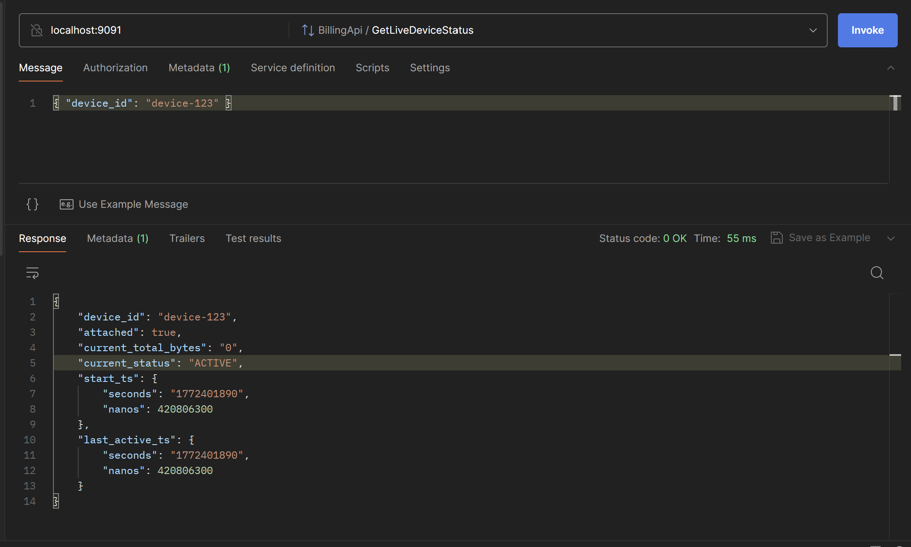
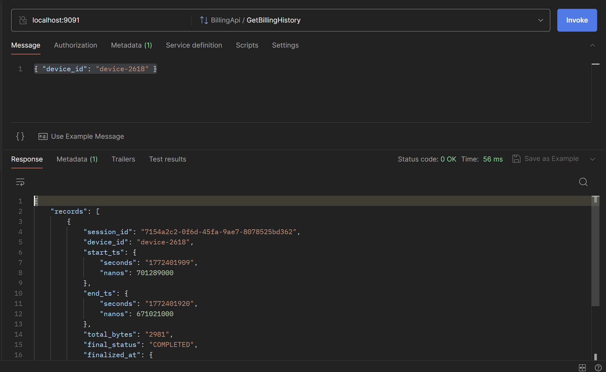

# API Server (gRPC)

This module exposes the assignment API layer using **gRPC**:

1. **Live Device Status**
   - Whether a device is currently attached
   - Current aggregated usage (if active)
2. **Billing History**
   - Last 10 completed billing records for a device

It reads from shared infrastructure used across services:
- **Redis** for live/in-progress session state
- **PostgreSQL** for completed billing sessions

This module also runs a background **stale-session sweeper**:
- Scans Redis session keys periodically
- Detects stale sessions using `lastActive` threshold
- Publishes `STALE_SESSION_DETECTED` events to Kafka using `device_id` as key
- Allows the responsible event-consumer partition to finalize the session safely

## gRPC Methods

Service: `skylo.billing.v1.BillingApi`

- `GetLiveDeviceStatus(LiveDeviceStatusRequest)`
- `GetBillingHistory(BillingHistoryRequest)`

Proto file:
- `src/main/proto/billing_api.proto`

## Authentication

This module uses token-based authentication via gRPC metadata:

- Header: `authorization`
- Format: `Bearer <token>`

Configured token:
- Property: `api.auth.token`
- Env var: `API_AUTH_TOKEN`
- Default local value: `skylo-dev-token`

## Input Validation

`device_id` must:
- be non-empty
- be at most 50 characters
- match regex: `^[a-zA-Z0-9._:-]+$`

Invalid input returns gRPC status `INVALID_ARGUMENT`.
Invalid/missing token returns `UNAUTHENTICATED`.

## Configuration

Default config is in `src/main/resources/application.properties`.

Important environment variables:

- `GRPC_PORT` (default: `9091`)
- `API_AUTH_TOKEN` (default: `skylo-dev-token`)
- `DB_HOST`, `DB_PORT`, `DB_NAME`, `DB_USER`, `DB_PASSWORD`
- `REDIS_HOST`, `REDIS_PORT`
- `KAFKA_BOOTSTRAP_SERVERS`, `IOT_EVENTS_TOPIC`
- `SWEEPER_SCAN_INTERVAL_MS` (default: `60000`)
- `SWEEPER_STALE_THRESHOLD_SECONDS` (default: `90`)

## Background Sweeper

- Job: `StaleSessionSweeperService`
- Scan pattern: `session:*`
- Eligible status: `ACTIVE`, `INFERRED_ACTIVE`
- Stale condition: `lastActive < now - stale-threshold`
- Emits event type: `STALE_SESSION_DETECTED`
- Two-phase stale states:
   - `STALE_CANDIDATE` before publish
   - `STALE_PENDING_PUBLISHED` after Kafka publish ack
- Includes recovery of old `FINALIZING` sessions to avoid stuck keys after SQL failures

## gRPC Endpoint Reference

- Server URL: `localhost:9091`
- Service: `skylo.billing.v1.BillingApi`
- Method: `GetLiveDeviceStatus` (full RPC: `skylo.billing.v1.BillingApi/GetLiveDeviceStatus`)
- Method: `GetBillingHistory` (full RPC: `skylo.billing.v1.BillingApi/GetBillingHistory`)
- Required metadata header: `authorization: Bearer <token>`

## Test with Postman (gRPC)

1. Create a new **gRPC Request** in Postman.
2. Connect to `localhost:9091`.
3. Import proto: `src/main/proto/billing_api.proto`.
4. Choose one of the methods under `skylo.billing.v1.BillingApi`.
5. Add metadata:
   - key: `authorization`
   - value: `Bearer skylo-dev-token`
6. Send request body:

```json
{ "device_id": "device-123" }
```

## Postman Output Screenshots

### Live Device Status



### Billing History


